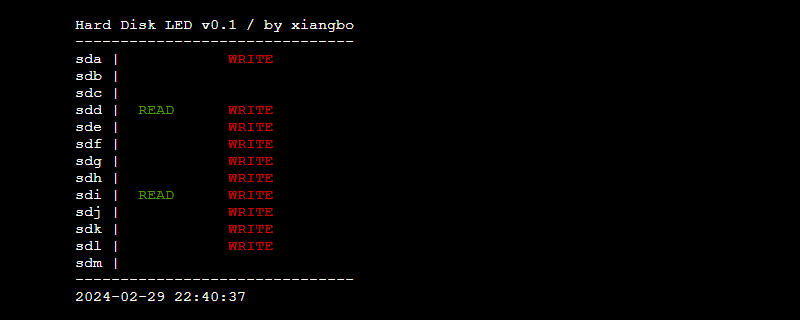

# 控制台硬盘读写状态监视
这是一个用于在Linux控制台中监视硬盘读写状态的程序。

## 使用方法 
这是个Bash脚本，在Linux中可直接运行。

```
./diskled.sh
```

# Disk LED status in Console
This is used to monitor hard disk Read/Write status in linux console

## Usage
It's a bash script, just run it.

```
./diskled.sh
```

*by xiangbo / 2024-03-01*

